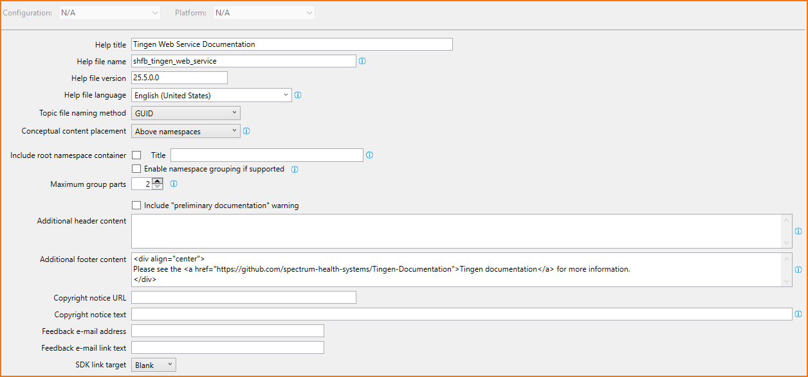
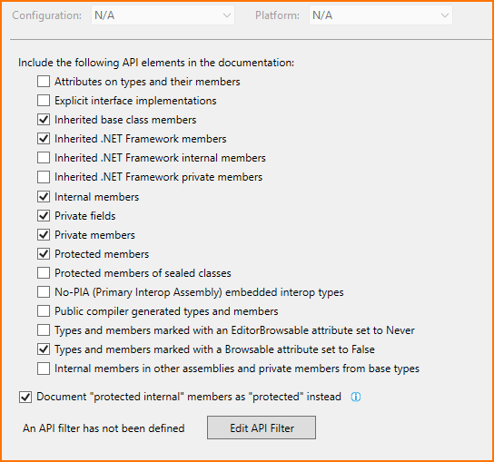
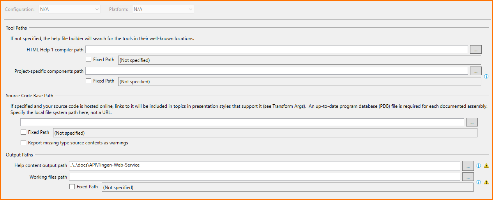
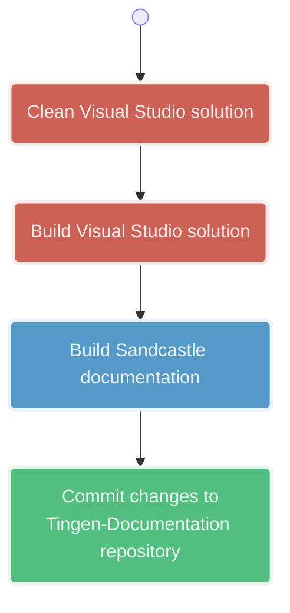

<!-- Last updated: 260820 -->

[The Documentation Project](../README.md) ❭ Sandcastle Help File Builder

<div align="center">

### The Documentation Project

  <picture>
    <source media="(prefers-color-scheme: dark)" srcset="../../.github/logo/dark/256x256.png">
    <source media="(prefers-color-scheme: light)" srcset="../../.github/logo/light/256x256.png">
    
  </picture>

# Sandcastle Help File Builder

</div>

| CONTENTS |
|:---------|
| [Integration with Visual Studio](#integration-with-visual-studio) |
| [Create a new Visual Studio Documentation Project](#create-a-new-visual-studio-documentation-project) |
| [Generating Sandcastle documentation](#generating-sandcastle-documentation) |
| [Customizing the documentation build](#customizing-the-documentation-build) |

***

## Integration with Visual Studio

Install the latest version of the [Sandcastle Help File Builder](https://github.com/EWSoftware/SHFB).

It is recommended to also install the [Extended XML Doc Comments Provider (VS2022+)](https://marketplace.visualstudio.com/items?itemName=EWoodruff.ExtendedDocCommentsProvider2022) extension.

## Create a new Visual Studio Documentation Project

You will need to create a Documentation Project for each project you want to document.

Documentation projects should start with `sfhb-`.

For example, the Documentation Project for the `myproject` would be named `sfhb-myproject`.

To create the new project:

1. Start Visual Studio
2. Create a new `Sandcastle Help File Builder Project`
3. Name the project `shfb-%Project-Name%` (example: `shfb-myproject`)
4. The location should be something along the lines of:  
* `myproject-documentation/sandcastle/%Project-Name%` (for dedicated documentation projects)  
* `myproject/shfb/shfb-%Project-Name%`  (for smaller projects)
5. Click "Create"
6. Close the project

### Add the documentation project to the solution

1. Open the *solution* that the documentation will be created for
2. Add a new Solution Folder named `SHFB`
3. Add the documentation project to the `SHFB` folder

### Generate XML documentation

In the project you are creating documentation for:

1. Right-click -> **Properties**
2. **Build** -> **Output**
3. Check **XML documentation file**
4. Change the file path to `AppData\XmlDoc\generated.xml

### Configure the documentation project

#### Project Properties -> Build

1. Change **Framework version** to the correct framework


#### Project Properties -> Help File

1. Change the **Help title**
2. Change the ** Help file version**
3. Add the following to **Additional footer content**  
```html
<div align="center">
Please see the <a href="https://github.com/spectrum-health-systems/myproject">MyProject</a> for more information.
</div>
```



(Ignore what the fields in this screenshot say, they will eventually be updated)

#### Project Properties -> Help 1/Website

No changes.

#### Project Properties -> MS Help Viewer

No changes.

#### Project Properties -> Summaries

No changes.

#### Project Properties -> Visibility

1. Check **Internal members**
2. Check **Private fields**
3. Check **Private members**



#### Project Properties -> Missing Tags

No changes.

#### Project Properties -> Paths

1. Change **Help content output path** to `..\..\docs\api`



(Ignore what the fields in this screenshot say, they will eventually be updated)

#### Project Properties -> Components

No changes.

#### Project Properties -> Plug-Ins

No changes.

#### Project Properties -> Transform Args

No changes.

#### Project Properties -> User Defined

No changes.

#### Project Properties -> Build Events

No changes.

### Add the project to the Documentation Sources

Using the documentation project:

1. Right-click -> *Documentation Sources*
2. **Add documentation source**
3. Add the `.csproj` file of the project you are documenting

### Exclude documentation projects from the Solution build

On the VS2022 menu bar:

1. **Build** -> **Configuration Manager**
2. Uncheck *Build* for all documentation projects

Save everything

## XML Documentation

You'll need to add [XML documentation](../../Documentation/XmlDocumentation-CSharp.md) to the code elements you want to be included in the generated API documentation.

## Generating Sandcastle documentation

<div align="center">



</div>

A few minutes after the `myproject` repository has been updated, the GitHub Pages site will be refreshed.

## Customizing the documentation build

### Excluding files/folders from the documentation build

To exclude files or folders from the documentation build, create a `_config.yml` file in the `docs/` directory.

The file should look like this:

```yaml
exclude:
  - appendix/
  - devman/
  - diagram/
  - glossary/
  - madc/
  - man/
  - release-notes/
  - source-code/
  - sourcecode/
  - testing/
  - CHANGELOG.md
  - CODEOWNERS
  - CONTRIBUTORS.md
  - DEVELOPMENT.md
  - FAQ.md
  - KNOWN-ISSUES.md
  - NOTICES.md
  - ROADMAP.md
  - SECURITY.md
  - SUPPORT.md
  - TROUBLESHOOTING.md
```

<br/>

***

[The Documentation Project](../README.md) ❭ Sandcastle Help File Builder
